<div align="center">







</div>

### `In [1]:` tech_stack

<div align="center">
  
</div>

<br/>

<div align="center">

**🧠 Data Science & ML**<br/>
<br/>


<br/>

**🌐 Web Development**<br/>
<br/>


<br/>

**💻 Languages**<br/>


<br/>

**🛠️ Tools & Databases**<br/>


</div>


### `In [2]:` code_dna

<div align="center">


</div>

<br/>

<div align="center">
  
</div>

<!--
  🐍 OPTIONAL: contribution snake
  1. Put .github/workflows/snake.yml in this repo and run the workflow once (Actions tab → Run workflow).
  2. Uncomment the block below.

<div align="center">
  <picture>
    <source media="(prefers-color-scheme: dark)" srcset="https://raw.githubusercontent.com/soumensen411/soumensen411/output/github-snake-dark.svg" />
    
  </picture>
</div>
-->


### `In [3]:` problem_solving

<div align="center">
  
</div>


### `In [4]:` featured_projects

<!-- 👇 Replace REPO_NAME_x with your best repos. -->
<div align="center">

<a href="https://github.com/soumensen411/REPO_NAME_1"></a>
<a href="https://github.com/soumensen411/REPO_NAME_2"></a>
<br/>
<a href="https://github.com/soumensen411/REPO_NAME_3"></a>
<a href="https://github.com/soumensen411/REPO_NAME_4"></a>

</div>


### `In [5]:` git log --oneline

```text
* 3f9a1c2 (HEAD -> main) feat: machine learning & data science
* 8b2d7e4 feat: problem solving on LeetCode & HackerRank
* c41e9a0 feat: full-stack web projects (React, Django, Flask)
* 7d05b3f chore: open source contributions
* 1a2b3c4 init: hello, world
```


### `In [6]:` connect(me)

<div align="center">

<a href="https://soumen.me" target="_blank"></a>
<a href="https://www.linkedin.com/in/soum-en-sen/" target="_blank"></a>
<a href="mailto:soumensen411@gmail.com"></a>
<a href="https://leetcode.com/u/soumensen411/" target="_blank"></a>
<a href="https://www.hackerrank.com/profile/Soumensen" target="_blank"></a>
<a href="https://www.instagram.com/soum_en_sen/" target="_blank"></a>

<br/><br/>


</div>
